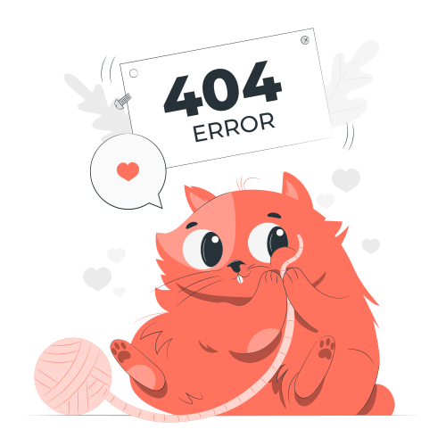

# PokeArchive

A Next.js client application for browsing and managing Pokémon-style catalog data, with authentication, internationalization, and a layered frontend architecture.

<p align="center">
  
</p>

*The same asset lives under [`src/app/shared/assets/images/not_found.svg`](src/app/shared/assets/images/not_found.svg) for imports from application code; the copy in `public/images` is used by `next/image` on the not-found screen.*

---

## Tech stack

| Area | Technology |
|------|------------|
| **Framework** | [Next.js](https://nextjs.org/) 15 (App Router, Turbopack in dev) |
| **UI** | [React](https://react.dev/) 19, [Tailwind CSS](https://tailwindcss.com/) 4 |
| **Components** | [Radix UI](https://www.radix-ui.com/), [shadcn-style](https://ui.shadcn.com/) primitives in `pkg/theme` |
| **Styling utilities** | [class-variance-authority](https://cva.style/docs), [clsx](https://github.com/lukeed/clsx), [tailwind-merge](https://github.com/dcastil/tailwind-merge) |
| **Animation** | [Framer Motion](https://www.framer.com/motion/) / [Motion](https://motion.dev/) |
| **Data fetching** | [TanStack Query](https://tanstack.com/query) (React Query), [ky](https://github.com/sindresorhus/ky) |
| **Forms & validation** | [React Hook Form](https://react-hook-form.com/), [Zod](https://zod.dev/), [@hookform/resolvers](https://github.com/react-hook-form/resolvers) |
| **Auth** | [Better Auth](https://www.better-auth.com/) (session routes under `app/(api)/auth`) |
| **State** | [Zustand](https://github.com/pmndrs/zustand) (e.g. auth store) |
| **i18n** | [next-intl](https://next-intl-docs.vercel.app/) (`en`, `de`, locale prefix always on) |
| **Theming** | [next-themes](https://github.com/pacocoursey/next-themes) |
| **Env validation** | [@t3-oss/env-nextjs](https://env.t3.gg/) |
| **Icons** | [Lucide React](https://lucide.dev/) |
| **Toasts / drawers** | [Sonner](https://sonner.emilkowal.ski/), [Vaul](https://vaul.emilkowal.ski/) |
| **SVG in bundler** | [@svgr/webpack](https://react-svgr.com/) |
| **Runtime** | Node.js **22.x** (see `package.json` / Volta) |
| **Package manager** | Yarn 1.x |

### Tooling & quality

- **TypeScript** — strict typing across `src/`
- **ESLint** — Next.js config, Prettier integration, import sorting
- **Prettier** — including `prettier-plugin-tailwindcss`
- **E2E tests** — [Playwright](https://playwright.dev/) (`__tests__/`)

### Deployment (optional in this repo)

- **[@opennextjs/cloudflare](https://opennext.js.org/cloudflare)** — build and deploy to Cloudflare (`deploy`, `preview` scripts; **Wrangler** as dev dependency)

---

## What you can use or add

The codebase is set up so you can extend it without restructuring everything:

- **API layer** — add REST clients under `src/pkg/rest-api` or new entity APIs under `src/app/entities/api/`.
- **Server state** — prefer TanStack Query hooks next to APIs (`*.query.ts` / `*.mutation.ts` pattern).
- **UI primitives** — keep shared building blocks in `src/pkg/theme/ui` or `src/app/shared/ui`.
- **New locales** — extend `src/pkg/locale/routing.ts` and translation JSON used by `next-intl`.
- **Auth flows** — align with Better Auth server helpers in `src/pkg/auth` and route handlers in `src/app/(api)/auth`.
- **Optional additions** (not installed by default but common with this stack): **Storybook** for components, **Vitest** or **Jest** for unit tests, **MSW** for API mocking, **Sentry** for error monitoring, **OpenAPI**-generated clients if the backend exposes a schema.

---

## Project structure

The app follows a **layered** layout (higher layers may depend on lower ones, not the reverse):

```
src/
├── app/
│   ├── (web)/           # App Router pages (locale segment, public/auth/protected routes)
│   ├── (api)/           # Route handlers (auth session, sign-in/up, etc.)
│   ├── modules/         # Page-level composition & business-oriented UI
│   ├── widgets/         # Self-contained UI blocks (header, lists, pagination, …)
│   ├── features/        # Focused features (e.g. auth form)
│   ├── entities/        # API clients, models, React Query hooks
│   └── shared/          # Shared UI, hooks, stores, assets
├── config/              # Env (T3), global styles
├── pkg/                 # Cross-cutting packages (theme, locale, auth, rest-api, utils)
└── middleware.ts        # i18n + auth redirects (e.g. `/items` guard)
```

---

## Getting started

### Prerequisites

- **Node.js 22.x**
- **Yarn** (see `packageManager` in `package.json`)

### Environment variables

Create `.env.local` in this directory with:

| Variable | Purpose |
|----------|---------|
| `NEXT_PUBLIC_CLIENT_WEB_URL` | Public URL of this Next app |
| `NEXT_PUBLIC_CLIENT_API_URL` | Backend API base URL |

Validation is enforced via `src/config/env/env.client.ts`.

### Install and run

```bash
yarn install
yarn dev
```

Open [http://localhost:3000](http://localhost:3000). Routes use a locale prefix (e.g. `/en`, `/de`).

### Other scripts

| Script | Description |
|--------|-------------|
| `yarn build` | Production build |
| `yarn start` | Start production server |
| `yarn type-check` | TypeScript check |
| `yarn lint` | ESLint (with fix) |
| `yarn prettier` | Format |
| `yarn format` | type-check + lint + prettier |
| `yarn devsafe` | Clean `.next` / `.open-next` then `next dev` |
| `yarn deploy` / `yarn preview` | OpenNext Cloudflare (requires env / Wrangler setup) |

---

## Testing

Playwright is configured in `playwright.config.ts`. Run E2E tests as documented in your CI or locally with the Playwright CLI after installing browsers.

---

## License

Private project (`"private": true` in `package.json`). Adjust this section if you publish the package.
